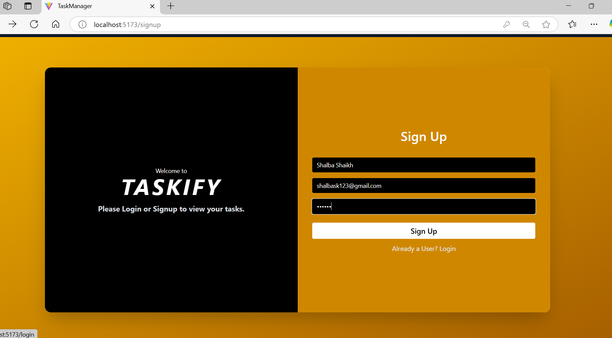
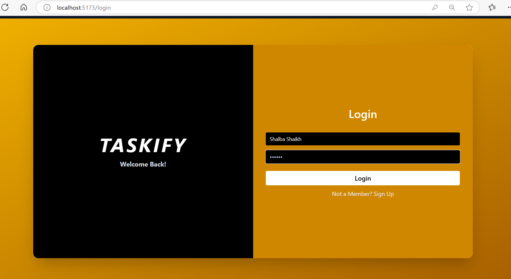
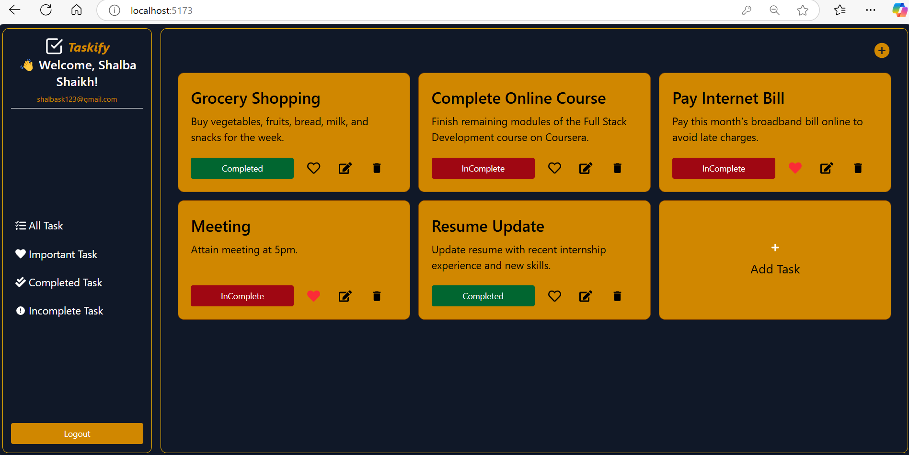
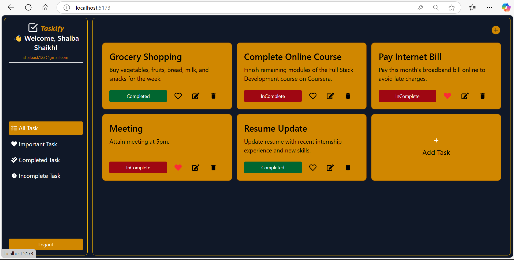

# 📝 Taskify- Task Management App

A full-stack Task Management Web Application built using the **MERN Stack (MongoDB, Express.js, React.js, Node.js)**. The app allows authenticated users to manage tasks efficiently by adding, editing, deleting, and marking tasks as complete or incomplete.

---

**🔧 Features**

- 🔐 User Authentication (Register / Login / Logout)
- ✅ Add, Update, Delete, and Complete Tasks
- 🎯 Task Prioritization (Favorite, Complete, Incomplete)
- 📅 Due Date for Tasks
- 🔍 Filter Tasks by status or priority
- 💾 Persistent storage with MongoDB
- 📱 Fully Responsive Design

---

**🛠️ Tech Stack**

**Frontend:**
- React.js
- Redux Toolkit
- Axios
- React Router DOM
- Tailwind CSS 

**Backend:**
- Node.js
- Express.js
- MongoDB with Mongoose
- JSON Web Token (JWT)
- bcrypt.js
- dotenv

---
**📸 Screenshots**
🔐 Signup Page  


🔐 Login Page  


🏠 Dashboard  


✅ Task Management  


---
**🔐 Authentication Flow**

- Passwords are hashed using bcrypt before storing in MongoDB.
- JWT tokens are used for user session management and route protection.
- Each task is linked to the specific authenticated user.

---

**🧪 Setup Instructions**

1. Clone the repository

```bash
git clone https://github.com/ShalbaShaikh16/Task_Management_MERN.git
```

2. Navigate to the root directory and open two terminal windows:

**For backend:**
```bash
cd server
npm install
npm run dev
```

**For frontend:**
```bash
cd client
npm install
npm start
```

3. Create a `.env` file in the `/server` folder with the following content:

```
MONGO_URI=your_mongodb_connection_string
JWT_SECRET=your_jwt_secret
PORT=3001
```

---

**🙌 Acknowledgements**

- [ReactJS Documentation](https://reactjs.org)
- [MongoDB Documentation](https://www.mongodb.com/docs/)
- [JWT Guide](https://jwt.io/introduction/)
- [Tailwind CSS](https://tailwindcss.com) 

---

**👩‍💻 Author**

**Shalba Shaikh**  
📧 [shalbashaikh16@gmail.com](mailto:shalbashaikh16@gmail.com)  
🔗 [GitHub - @ShalbaShaikh16](https://github.com/ShalbaShaikh16)

---

**📄 License**

This project is licensed under the MIT License - see the [LICENSE](./LICENSE) file for details.
```
